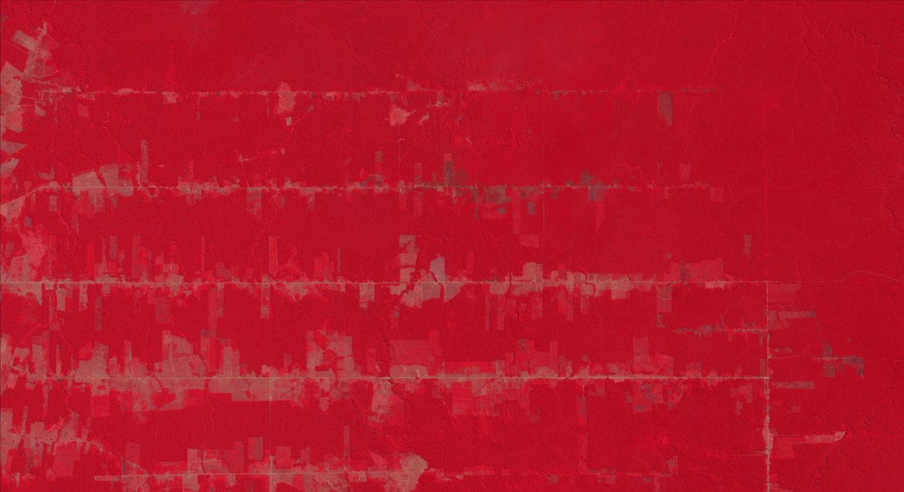
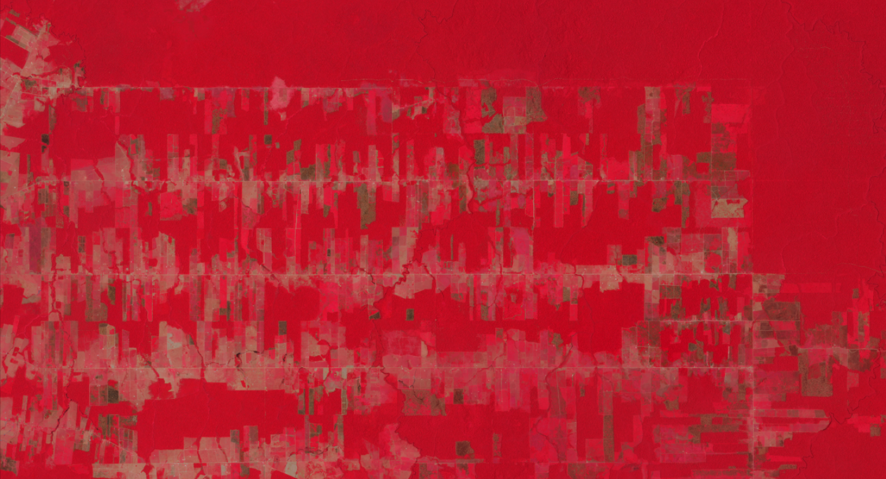

# Amazônia

Medição de área desmatada em um trecho da Amazônia utilizando técnicas de Processamento digital de imagens

- [**Relatório**](relatorio/relatorio-amazonia.pdf)
- [**Apresentação**](apresentacao/apresentacao-amazonia.pdf)
- [**Código**](amazonia.m)

## Uso

- Abrir script [amazonia.m](amazonia.m) no MATLAB
- Baixar 2 imagens de satélite no formato CIR (color infrared)
  - Imagens da mesma área em momentos distintos de tempo
  - Recomendado: Imagens gratuitas do Planet Labs: https://www.planet.com/explorer/?s=UNS6fwFDRaOTUSdpRXroiQ
  - Imagens inclusas no repositório: Junho 2016, Junho 2017, Novembro 2022 e Maio 2023
- Escolher 2 imagens para análise
- Inserir área em km² da imagem
- Rodar programa
- Clicar nas áreas de floresta
- Ler terminal para obter área desmatada

## Exemplo

- Imagem 1: Junho 2017



- Imagem 2: Novembro 2022



- Área: 1.243 km²

- Output:

```
================ NDVI ================
Área analisada = 1.2430 km^2 	(100.00%)
--------------------------------------
Floresta
--------------------------------------
Antigo  : Área = 0.9838 km^2 	(79.15%)
Novo    : Área = 0.7416 km^2 	(59.66%)
Diff    : Área = -0.2422 km^2 	(-19.49%)

================ CIR =================
Área analisada = 1.2430 km^2 	(100.00%)
--------------------------------------
Floresta
--------------------------------------
Antigo  : Área = 0.9787 km^2 	(78.74%)
Novo    : Área = 0.7342 km^2 	(59.07%)
Diff    : Área = -0.2446 km^2 	(-19.67%)
```
